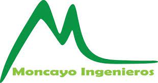

# Sobre nosotros

Moncayo Ingenieros agrupa a un conjunto de técnicos cualificados con experiencia contrastada en la realización de proyectos, necesarios para la ejecución de los diferentes tipos de obras y actividades en los campos de la edificación, ingeniería y consultoría.

Con el objetivo de dar una solución integral a nuestros clientes, contamos con empresas colaboradoras externas que nos complementan y nos permiten la posibilidad de ofrecer proyectos llave en mano, ejecutando bajo nuestra estricta supervisión las obras que proyectamos. Nuestra máxima es conseguir la satisfacción del cliente, aportando desde nuestro servicio de ingeniería. las soluciones más económicas posibles para lograr los objetivos previstos.

markdown_extensions:

    - admonition
    - pymdownx.details
    - pymdownx.superfences

    !!! note "Anotació"
    Esta part si que la podeu provar a casa.

!!! warning "Compte!"
    Aneu amb compte al realitzar esta part.

!!! danger "Perill!!"
    No proveu açò a casa.
